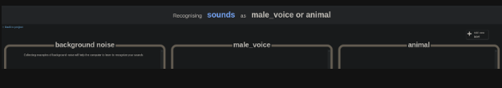
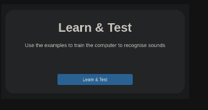
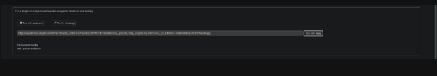

# Create Your Own Dataset

Bearing in mind the qualities of a good dataset create your own dataset [here](https://machinelearningforkids.co.uk/).

1. Name and define the type of dataset to create

2. Click on the train step and gather data. 

If you choose to create a dataset to recognise text, images, numbers or sounds you must create labels within your dataset to help the model distinguish between categories.  

If you choose to build a dataset to predict numbers you need to create a spreadsheet. Create a column for each numerical feature that needs to be considered and a column for the value to predict. The predict column must be clearly marked.

3. When the dataset is complete click on the learn and test step. 

The model is created in the background. Enter in a value to test the accuracy of the model. 

The higher the accuracy the better. If the accuracy is very low add more examples for that label. Ensure that there is diversity in the examples. Note the range of breeds of dog under the dog label above. The dogs are pictured doing different activities and in various environments. 
