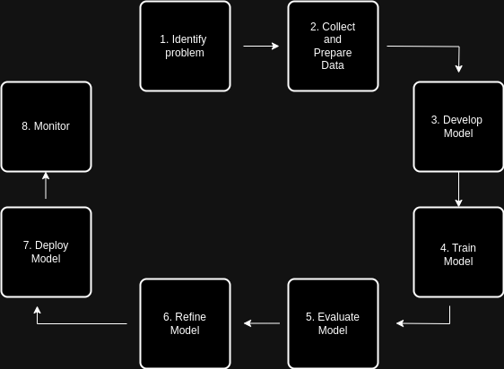

# Introduction to Datasets
Data is the foundation of any AI model. An AI model is only as good as the data it is trained on. This section focuses on the second stage of the development lifecycle for AI models.

## What is Data

Data is any fact gathered through observations and measurements. Data can take many forms, namely text or numerical. Data is the raw information that lacks context. A measurement of five means nothing, but if someone reported that they saw five red cars in the car park that now becomes valuable information with context.

## What is a Dataset

A dataset is a structured collection of data. The data within the set is related and when considered as one paints a bigger picture. The local council might have a dataset of property in the area. For each property there would be information on its value, size, use, owner and age. From this dataset the council can figure out if there are enough houses in the area or if there are many old properties in the area that need to be modernised. 

Imagine a dataset like a spreadsheet with rows and columns. The dataset described above has an entry (row) per property. The dataset has 5 columns, in the field of data science and AI these are referred to as features. Meaning the local property dataset looks at the value, size, use, owner and age features of properties. There is no limit to the amount of features and all relevant features should be recorded.

## Importance of a Good Dataset

The quality of the dataset impacts the quality of the AI model being built - “Garbage in, garbage out”. If the dataset gathered does not reflect the state of the problem area the model will never produce helpful or accurate results. For example, a shop keeper wants to predict how many boxes of apples they should buy. There is no point in using a dataset that tracks the sale of oranges, but equally there is no use in analysing the sale of apples in Mexico when the shop is located in Ireland. The size of the dataset is important. The dataset must be large enough to capture relevant information. Think about the concept of data sampling used when interviewing for a survey.
