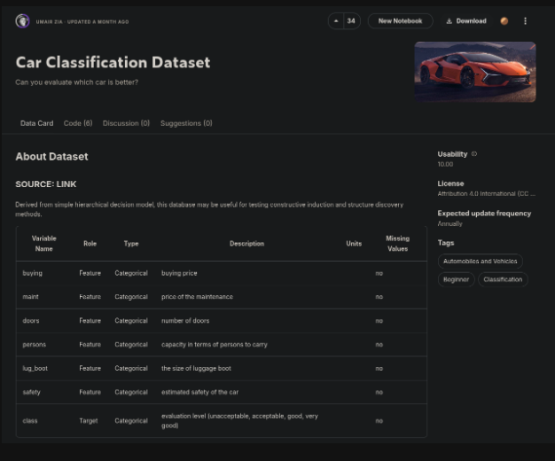

# Kaggle

As you now know from the exercise above it can take time to build up a representative dataset. It would be faster to use an existing dataset that suits the problem area. [Kaggle](https://www.kaggle.com/datasets) hosts a range of freely available datasets that should cover most use cases. However, if building a model for enterprise or a new topic you will need to build the dataset.

Here is an example of a dataset that looks at the factors consumers consider before purchasing a car.  The dataset can be downloaded directly. There is also the option to create a new notebook that automatically loads in the dataset in an environment ready for development.

Kaggle can be considered the data science and AI equivalent to GitHub. Developers can share datasets and also the applications built using the dataset. Look at the code tab under an interesting dataset to see how others used it.

# Notebooks 

A notebook is the preferred method of writing code in the data science and AI area. Notebooks combine code, markdown and visualisations in one file. The code segments in a notebook are generally written in Python, R or SQL. A notebook is composed of a series of cells that can be run individually or the entire notebook can be run in sequence. This makes notebooks much more interactive than a Python script for example. It is also easier to see the development steps and thought process of the developers. Examine the [sample notebook](https://www.kaggle.com/code/stealthtechnologies/getting-started-with-cars-classification).

The sample notebook can be run on a laptop but it is not advised. It is recommended to run a notebook on a supported service. A notebook as a service is a preconfigured environment with the tools needed for data science and AI work. These platforms offering a notebook as a service run the notebook on the cloud with increased resources than your laptop. Many of these services provided access to specialised hardware such as GPUs speeding up the training of the AI model being developed.

Jupyter Notebook is the original notebook format. Nowadays there are multiple [notebook platforms](https://datasciencenotebook.org/). 

Kaggle has a feature to easily spin up a notebook for the dataset. Google also has a notebook platform called Colab. Users can import their own datasets hosted in their Google Drive account. 

# Exercise: Create a Notebook

In this exercise you will create a notebook to perform EDA (Exploratory Data Analysis) on a dataset that will be used to build a model. EDA is the process of analysing, preparing and cleaning the data to be suitable for the next phase of the AI lifecycle.

1. Read through the example [EDA notebook](https://www.kaggle.com/code/imoore/intro-to-exploratory-data-analysis-eda-in-python)

2. Create an account on Kaggle and find a dataset

3. On the dataset page click the create notebook option.

4. Using the example notebook perform EDA on your selected dataset.